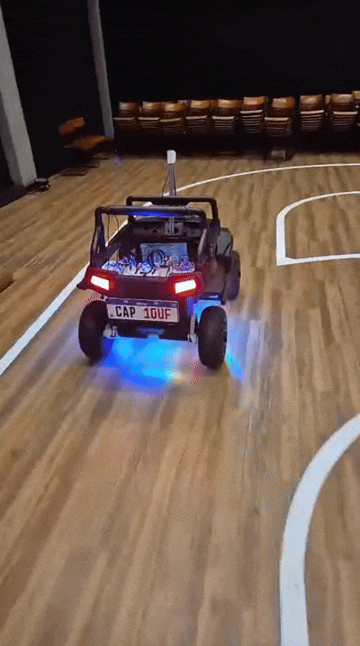
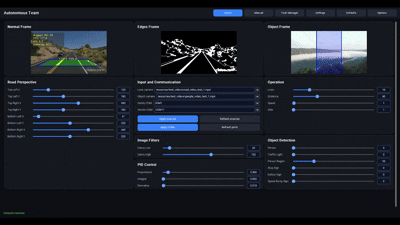

# Autodrive

Aplicacao Python para controle e monitoramento de um carro autonomo com UI em
CustomTkinter, processamento de video com OpenCV/YOLO, comunicacao serial com o
microcontrolador e painel web opcional via Flask.

## Demo

### Autonomous car in action



### Desktop monitoring interface



## Requisitos

- Python 3.10+ recomendado.
- Camera USB ou arquivo de video em `resources/test_videos`.
- Porta serial disponivel quando o envio para o microcontrolador estiver ativo.
- Modelos YOLO baixados/carregados localmente conforme necessidade.

Instalacao das dependencias:

```powershell
python -m venv .venv
.\.venv\Scripts\Activate.ps1
pip install -r requirements.txt
```

## Como Rodar

```powershell
python main.py
```

Na inicializacao, a aplicacao detecta cameras disponiveis, lista portas seriais,
carrega configuracoes de `config/` e abre a UI principal.

## Portas E Interfaces

- UI desktop: CustomTkinter, iniciada pelo processo principal da aplicacao.
- Web server: Flask em `http://localhost:5000`, ativado quando `WEBVIEW` estiver
  ligado na UI/configuracao.
- Shutdown Flask: `http://localhost:5000/shutdown`.
- Serial: porta selecionada pela UI/configuracao, normalmente `SENDER_COM`.

## Cameras, Videos E Modelos

- Fontes de video sao detectadas a partir dos indices de camera disponiveis.
- Videos de teste podem ficar em `resources/test_videos`.
- O detector base usa YOLO e pode baixar/carregar `yolov8n.pt`.
- Modelos customizados sao procurados em saidas de treino como
  `runs/detect/*/weights/best.pt`, incluindo caminhos dentro de
  `utils/model_trainer`.

## Fluxo Principal

1. `main.py` cria controles compartilhados com `multiprocessing.Manager`.
2. A UI inicial coleta flags e calibracoes.
3. `ProcessManager` inicia UI e envio serial.
4. Conforme as flags, sao iniciados/parados processos de camera, deteccao de
   faixa, deteccao de objetos, modo manual e Flask.
5. Frames e telemetria circulam por dicionarios compartilhados e filas.
6. O envio serial publica direcao, velocidade e estado do semaforo para o
   microcontrolador.

## Organizacao

- `src/application`: casos de uso, inicializacao e orquestracao de processos.
- `src/domain`: modelos, constantes e regras de decisao sem dependencia de IO.
- `src/infrastructure`: adapters, fachadas de compatibilidade, persistencia,
  logging e integracoes com camera, serial, Flask, OpenCV e YOLO.
- `src/presentation`: UI desktop e elementos visuais.
- `utils/model_trainer`: scripts e artefatos de treino YOLO.
- `microcontroller`: codigo do microcontrolador.

## Arquitetura

Este projeto segue uma arquitetura Clean/Hexagonal pragmatica com dominio leve:

- `domain` concentra decisoes puras do carro, como parada, retomada, lombada,
  desvio e semaforo.
- `application` coordena processos, inicializacao e estado compartilhado.
- `infrastructure` integra IO e frameworks: camera, serial, Flask, OpenCV, YOLO,
  JSON e logging.
- `presentation` concentra a UI desktop e renderizacao visual.

O estado compartilhado ainda usa `multiprocessing.Manager().dict()`, mas o acesso
deve passar gradualmente pelos wrappers em `src/application/state` para reduzir
chaves string espalhadas pelo codigo.

## Observacoes De Versionamento

Os diretorios de treino em `utils/model_trainer/runs`, `yolo_runs` e `dataset`
sao ignorados para evitar novos artefatos grandes no Git. Se algum peso ou
dataset especifico precisar ser versionado, adicione-o de forma explicita.
