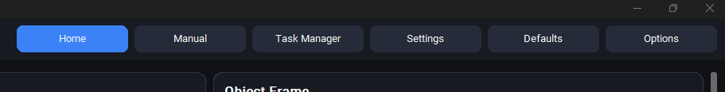
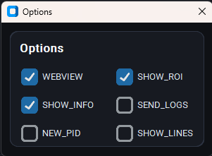
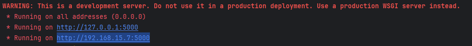
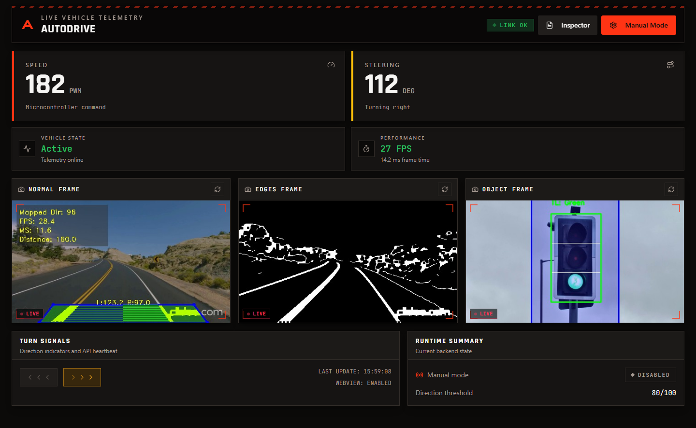
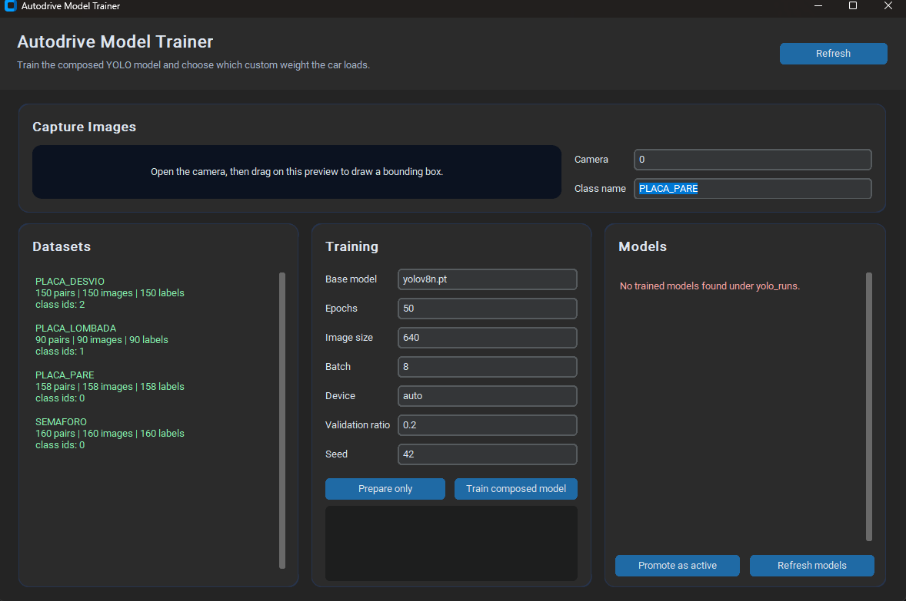

# Autodrive

Python application for controlling and monitoring an autonomous car, with a
CustomTkinter desktop UI, OpenCV/YOLO video processing, serial communication
with the microcontroller, and an optional Flask web panel.

Autodrive is designed as a resilient real-time control dashboard: cameras,
serial ports, control parameters, detection thresholds, perspective points, PID
values, and runtime flags can be changed while the system is running. If a
microcontroller or camera source is disconnected, the application keeps the
runtime alive and attempts to recover when the resource becomes available again.

## Demo

### Autonomous car in action


### Desktop monitoring interface


## Requirements

- Python 3.10+ recommended.
- [PyCharm](https://www.jetbrains.com/pycharm/download/) recommended, because
  it provides native support for Python interpreters, virtual environments,
  dependency installation from `requirements.txt`, run configurations, and
  debugging.
- USB camera or video file in `resources/test_videos`.
- Available serial port when microcontroller transmission is enabled.
- YOLO models downloaded/loaded locally as needed.

Open the project in PyCharm, select or create a Python interpreter, and let the
IDE install the packages listed in `requirements.txt` when prompted.

## How To Run

Open `main.py` in PyCharm and run it with the IDE run button. PyCharm will keep
the interpreter, working directory, environment, logs, and debugger in one
place, which is especially useful for this project because it starts multiple
processes and interacts with cameras and serial ports.

On startup, the application detects available cameras, lists serial ports, loads
settings from `config/`, and opens the main UI.

## Optional WebView Frontend

The desktop application can expose a Flask API/WebView backend that is consumed
by the React frontend in `frontend/`. Use this flow when you want to run the web
dashboard in the browser.

### 1. Enable WebView in the desktop UI

Open the desktop application, click **Options**, and enable **WEBVIEW**.





### 2. Copy the Flask address from PyCharm

After enabling `WEBVIEW`, the PyCharm PowerShell console prints the Flask
addresses. Copy the reachable network address, for example
`http://192.168.15.7:5000`.



### 3. Point the frontend to the Flask API

Open `frontend/src/config/api.ts` and set the API base URL to the address printed
by Flask:

```ts
const DEFAULT_API_BASE_URL = "http://192.168.15.7:5000";
```

You can also use `VITE_API_BASE_URL` if you prefer environment-based
configuration, but editing `api.ts` is the simplest local setup.

### 4. Install and run the frontend

From the `frontend/` directory:

```powershell
npm i
npm run dev
```

Then open the Vite URL shown in the terminal. The web dashboard should connect
to the Flask backend and render the live vehicle feeds and telemetry.



## Runtime Features

- Live dashboard with lane, edge, and object-detection video feeds.
- Runtime tuning for camera sources, serial ports, Canny filters, road
  perspective, PID control, operation values, and object-detection thresholds.
- Manual Mode for direct speed and steering control, including a visual steering
  wheel and dedicated manual video source.
- Task Manager view for monitoring Python process count, memory, CPU, IO, and
  per-process priority while the application is running.
- Optional Flask web panel for remote/manual speed control when `WEBVIEW` is
  enabled.

Most mutable values are stored in JSON files under `config/` and synchronized
with the shared runtime state. Slider changes are debounced before being
persisted, so the UI stays responsive while still keeping calibration values up
to date.

## Resilience

- Serial transmission is fault tolerant: if the selected microcontroller port is
  unavailable or disconnected, the sender skips failed writes and keeps trying
  to reconnect instead of crashing the application.
- Camera/video sources are monitored by their capture processes. Failed frames,
  unavailable sources, and video restarts are handled so the UI can remain open
  and recover when input becomes valid again.
- Backend processes are isolated from the UI with multiprocessing, shared
  dictionaries, and queues. This keeps expensive vision work away from the
  interface thread and allows the dashboard to continue rendering status while
  workers restart or recover.

## Performance Notes

- Camera capture, lane detection, object detection, serial sending, Flask, and
  manual mode run in separated processes when enabled.
- The desktop UI renders live frames only for the active view and pauses Task
  Manager refreshes when the view is not visible.
- Video frames are resized for the available UI area, and slider persistence is
  debounced to avoid excessive disk writes.

## Ports And Interfaces

- Desktop UI: CustomTkinter, started by the main application process.
- Web server: Flask at `http://localhost:5000`, enabled when `WEBVIEW` is turned
  on in the UI/settings.
- Shutdown Flask: `http://localhost:5000/shutdown`.
- Serial: port selected through the UI/settings, usually `SENDER_COM`.

## Cameras, Videos And Models

- Video sources are detected from the available camera indexes.
- Test videos can be placed in `resources/test_videos`.
- The base detector uses YOLO and can download/load `yolov8n.pt`.
- Custom object models can be trained with the local trainer entrypoint in
  `utils/model_trainer/run_trainer.py`.
- The trainer defaults to the composed model (`todos_objetos`) used by the car
  and can promote one trained weight as the active model.
- When `config/model_registry.json` points to a valid active model, Autodrive
  loads only that custom model and ignores the other training outputs.
- If no active model registry exists, Autodrive falls back to the legacy
  discovery of `runs/detect/*/weights/best.pt`.

## Training Custom Models

Open `utils/model_trainer/run_trainer.py` in PyCharm and run it from the IDE.
The trainer shows available datasets, validates image/label pairs, prepares a
composed YOLO dataset, streams training logs, lists generated weights, and lets
you promote one model as active for the main application.
It also includes a camera capture panel where you can draw a bounding box,
start tracking, record frames automatically, and save YOLO labels in real time.



Recommended flow:

1. Run `utils/model_trainer/run_trainer.py` from PyCharm.
2. In **Capture Images**, set the camera index, class name, class ID, and auto
   capture FPS.
3. Click **Open camera**.
4. Draw a bounding box over the object in the camera preview.
5. Click **Start tracking** to keep the bounding box following the object.
6. Use **Save frame** for manual captures or **Toggle recording** for automatic
   image/label capture.
7. Repeat the capture for every class the car should detect, such as
   `PLACA_PARE`, `PLACA_LOMBADA`, `PLACA_DESVIO`, and `SEMAFORO`.
8. Click **Refresh datasets** and confirm the datasets are valid.
9. In **Training**, keep the default composed model settings or adjust YOLO
   parameters, then click **Train composed model**.
10. In **Models**, select the generated weight and click **Promote as active**.

After promotion, Autodrive writes `config/model_registry.json` locally. On the
next application run, the object detector loads only that active custom model;
if the registry is missing or invalid, it falls back to legacy model discovery.

Training outputs remain local by default. Existing trained models are not
overwritten: each new run receives a timestamped folder under
`utils/model_trainer/yolo_runs`. Promoting a model only updates the local
`config/model_registry.json` pointer; it does not copy, delete, or replace
weight files.

## Main Flow

1. `main.py` creates shared controls with `multiprocessing.Manager`.
2. The UI prepares startup flags and calibration values.
3. `ProcessManager` starts backend processes and serial transmission.
4. Based on the flags, camera, lane detection, object detection, manual mode,
   and Flask processes are started or stopped.
5. Frames and telemetry move through shared dictionaries and queues.
6. Serial transmission publishes direction, speed, and traffic light state to
   the microcontroller.

## Organization

- `src/application`: use cases, startup flow, and process orchestration.
- `src/domain`: models, constants, and decision rules without IO dependencies.
- `src/infrastructure`: adapters, compatibility facades, persistence, logging,
  and integrations with camera, serial, OpenCV, and YOLO.
- `src/presentation`: desktop UI, visual elements, and the Flask web API.
- `utils/model_trainer`: YOLO training scripts and artifacts.
- `microcontroller`: microcontroller code.

## Architecture

This project follows a pragmatic Clean/Hexagonal architecture with a lightweight
domain:

- `domain` contains pure car decisions, such as stop, resume, speed bump,
  detour, and traffic light behavior.
- `application` coordinates processes, startup, and shared state.
- `infrastructure` integrates IO and technical services: camera, serial,
  OpenCV, YOLO, JSON, and logging.
- `presentation` contains the desktop UI, visual rendering, and Flask API
  endpoints exposed to the user.

Shared state still uses `multiprocessing.Manager().dict()`, but access should
gradually go through the wrappers in `src/application/state` to reduce scattered
string keys across the codebase.

## Versioning Notes

Training directories under `utils/model_trainer/runs`, `yolo_runs`, and
`dataset` are ignored to avoid adding new large artifacts to Git. If a specific
weight file or dataset must be versioned, add it explicitly.
